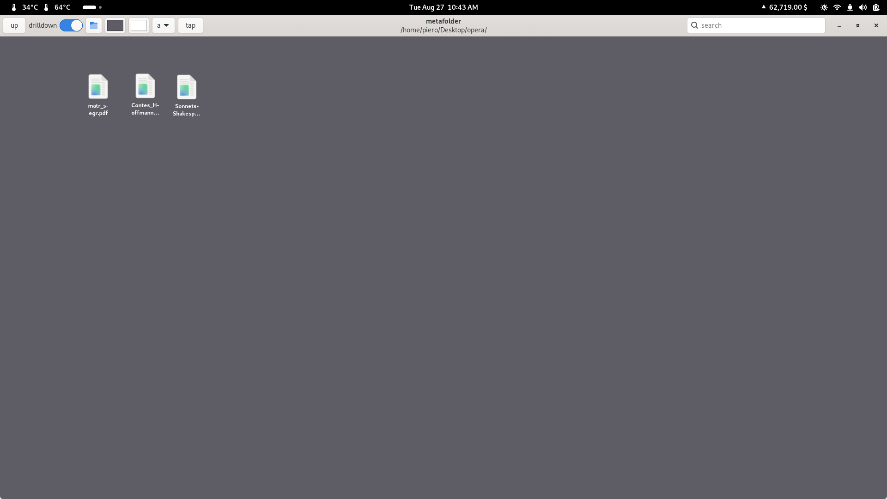

# metafolder

A small desktop icon manager for gnome 42+.

## Features:
 - Allowing for manual, exact placement of icons
 - Ability to choose background color, font color, font size, icon size
 - zoom in/out, useful when showing on a smaller/larger monitor
 - search function
 - drilldown function
 - Ability to show any folder as desktop
 - Will keep desktop settings when folder is moved

## Npn-features
 - Automatic placement of icons: metafolder will never move your icons from the position you placed them at
 - File management: all file management (file move/delete/rename/add) is delegated to the file system

## TODO
 - memorization of last used folder

## Latest release:

[0.4.0](https://github.com/pierods/metafolder/releases/tag/v0.4.0)